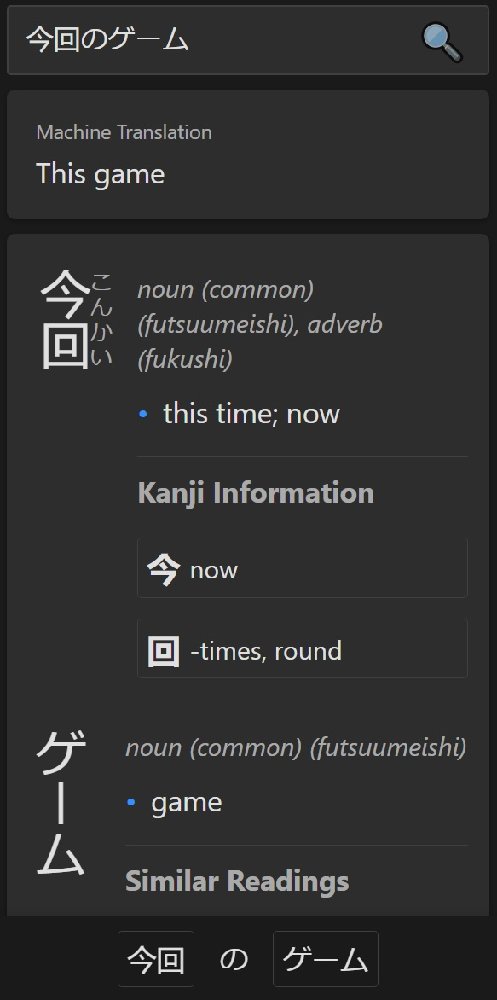

# JP-DIT

A free web-based Japanese dictionary app designed to work well when embedded in Calibre.

## Preview



## Features

- **Tokenization**: Extracts Japanese words from a provided text.
- **Word Information**:
  - Meanings (JMDict)
  - Pronunciation (JMDict+KanjiDict)
  - Kanji meanings (KanjiDict)
- **Machine Translation**: Full sentence translations.
- **Web Interface**: Designed to run embedded on [Calibre](https://calibre-ebook.com) or a web browser.

## Installation and Usage

### For Development
This is a standard nextjs app, so you'll need node/npm. Then just run:

```
npm run dev
```

### Build Prerequisites

- [Docker](https://www.docker.com/) installed on your machine.

### Build and Run Using Docker

1. Clone or download and extract the repository zip file.
2. `docker build -t jpdit .`
3. `docker run -p 3000:3000 jpdit`
4. Open a web browser and go to `http://localhost:3000`.

You can set to dark theme with the query param `theme=dark`, you can search for a word with `q={WORD}`, e.g:

```
http://localhost:3000/?theme=dark&q={word}
```

The first search may be quite slow since the dictionaries will be loaded to memory, subsequent searches should be much faster.